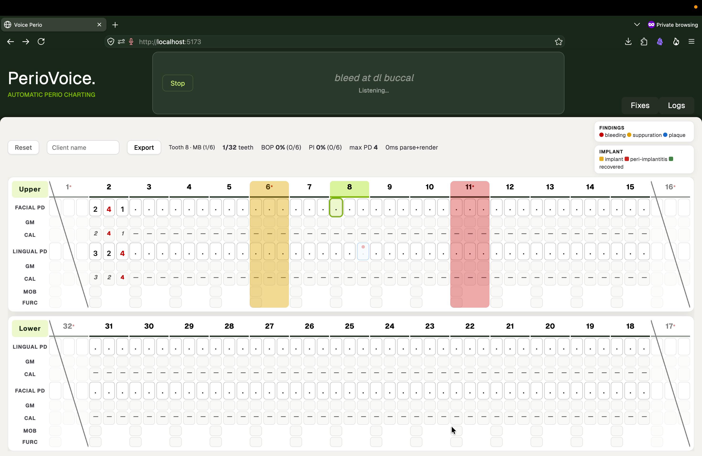

# PerioVoice

### **DSOLVE 2026** · DRISHTI · College of Engineering Trivandrum (CET)

**BUILD. SOLVE. DEMONSTRATE.**

|                   |                                           |
| ----------------- | ----------------------------------------- |
| **Problem:**      | Problem 7 — Real-Time Clinical Measurement |
| **Team Name:**    | LocalOps                          |
| **Team Members:** | Abraham Jacob Pathil · Joel Lijo Mathew · Nikhil M Warrier · Johann Thomas Philip |
| **Institution:**  | College of Engineering Trivandrum (CET)   |
| **Live Demo:**    | TBD                     |
| **Pitch Video:**  | [Instagram Reel](https://www.instagram.com/p/DdcJ9SDx6Ik/)           |

---

## Table of Contents

- [Problem Statement](#problem-statement)
- [Our Solution](#our-solution)
- [Key Features](#key-features)
- [Screenshots & Demo](#screenshots--demo)
- [Tech Stack](#tech-stack)
- [Getting Started](#getting-started)
- [Usage / Demo Script](#usage--demo-script)
- [Limitations & Future Scope](#limitations--future-scope)
- [Team](#team)
- [Submission Checklist](#submission-checklist)

---

## Problem Statement

> ## Problem 7: Real-Time Clinical Measurement
>
> Develop a real-time or near-real-time voice solution that enables dental
> professionals to capture and record clinical measurements with minimal delay.
>
> The solution should process spoken measurements such as pocket depth,
> bleeding, recession, and other periodontal findings, converting them into
> structured data and reflecting them in the application almost instantly. It
> should explore ways to combine speech recognition, rule-based processing,
> and AI while handling corrections, repeated measurements, and natural
> variations in speech.
>
> The goal is to reduce processing latency and manual data entry, creating a
> fast, seamless, hands-free clinical documentation experience.

### Why this matters

- **Infection control:** every keyboard touch mid-exam is a contamination event.
- **Staff time:** frees an est. ~$25/hr of assistant time per session
  (loaded wage × scribe minutes) from scribing numbers for higher-value
  chairside care.
- **Throughput:** a solo hygienist charts far fewer full mouths per day.

---

## Our Solution

**PerioVoice** — a local, **browser-based** voice perio chart. The hygienist
speaks measurements hands-free (`three two three, bleeding…`) and the
Open Dental-style chart fills in real time, with JSON export for existing
practice-management software. No cloud, no keyboard — the team stays
focused on the patient, not on scribing.

Architecture: a WebAssembly speech recognizer (Vosk, on-device) streams
partials/finals into a deterministic dependency-free JS parser (`perio.js`),
constrained by a strict clinical grammar (`grammar.json` acts as a
Grammar-FST — a word outside the vocabulary physically cannot be
transcribed). On the PS's speech-recognition/rule-based/AI combination:
speech recognition handles audio→words, rules handle words→chart (exact,
undoable, ~1ms); generative AI is deliberately excluded from the hot path
— latency budget and determinism leave no room for it. Decode plus parse
run in tens of milliseconds with zero network hops; full-utterance budget
is sub-300ms, verified per-machine.

Zero ongoing inference or hosting cost.

What makes it different:

1. **Solo-friendly charting** — full mouth hands-free (designed for under
   3 minutes), with the team free for patient care instead of scribing.
2. **Absolute data privacy (zero HIPAA liability)** — audio never leaves
   the device: no transmission, no storage, no breach surface.
3. **Zero compute cost** — an est. ~$3,100/year per practice in cloud
   STT/hosting fees avoided (per-minute pricing × charting volume);
   runs on the office PC already in the room.
4. **Instant feedback** — numbers appear as fast as they're spoken.
5. **Grammar-gated accuracy** — parser 99.8% on ground-truth transcripts, with no LLM hallucinations possible by construction.

---

## Key Features

- **Hands-free depth charting** — triplets, site-targeted writes
  (`MB 6`), row parking (`buccal`/`lingual`), bleeding/plaque/suppuration
  flags, recession (±GM), mobility, furcation, missing/implant/
  peri-implantitis/recovered states
- **Voice corrections & undo** — `change last to 5`, `scratch that`,
  utterance-level `undo`, `clear tooth`; spoken summaries after the beep
- **Navigation by voice** — teeth, FDI, Palmer, anatomical names
  (`upper right first molar`), `jump`, `repeat`, `next`
- **Live chart UI** — BOP/PI%/max-PD summaries, auto-CAL, click-to-cursor,
  inline cell typing, mobile scroll layout, JSON report download
- **Offline-first** — works with no connection after first load; mishearing
  fixes user-editable, no code changes

---

## Screenshots & Demo

| Screenshot / clip | Description |
|---|---|
|  | Chart filling live during voice dictation |
| [Demo recording](./assets/demo/screencap.mov) | Full hands-free charting pass |
| Pitch video (>30s) | [Instagram reel](https://www.instagram.com/p/DdcJ9SDx6Ik/) |

---

## Tech Stack

| Layer | Technology | Why we chose it |
|---|---|---|
| Frontend | Svelte 5 + Vite 6, pnpm | Runes-based reactivity, tiny bundle, fast builds |
| Speech (primary) | vosk-browser (Vosk WASM, small-en-us 41MB) | On-device, offline, grammar-constrainable, zero cost |
| Speech (fallback) | Web Speech API (Chrome/Edge) | Zero-download path where allowed |
| Parser | Hand-written dependency-free JS (`perio.js`) | Deterministic, testable in node, ~1ms, undoable |
| Backend | None (static file server only) | No data ever leaves the device |
| Database | None (JSON export) | PMS integration via downloaded reports |
| Test harnesses | Python (synthetic patients, TTS acoustic eval) | Python is test-only; the live app is 100% JS/WASM |

---

## Getting Started

### Prerequisites

- Node.js ≥ 18, `pnpm` ≥ 9
- Chrome/Edge (mic + `localhost`/https required — never `file://`)
- No accounts, no API keys, no secrets of any kind (by design — there is
  nothing to configure)

### Installation

```sh
cd frontend
pnpm install     # dependencies
pnpm setup       # one-time: downloads the Vosk model into public/ (gitignored)
pnpm dev         # localhost dev server
```

Useful commands (all run from `frontend/`): `pnpm test` (unit),
`pnpm build`, `pnpm eval` (synthetic accuracy), `pnpm cases` (38 narrative
cases), `pnpm acoustic` (speech-accuracy harness). Open `/bench.html` on
any machine for a zero-install latency/accuracy report.

---

## Usage / Demo Script

_3-minute runbook. Type in the fallback box if the room is too loud._

1. **Boot** — `pnpm dev`, open the page, click **Start?** (or press Space).
2. **Chart** — say `tooth 12, three two three, bleeding` — watch the
   cursor advance and the red dot land. Try `jump 14`, `four five four`.
3. **Correct by voice** — say `change last to 5`, then `undo` to take it back.
4. **Highlight** — mark `tooth 30 implant`, probe it, say `peri-implantitis`;
   the column tints red. Say `bleeding on buccal` after a full tooth and it
   attaches correctly. Export the JSON report.
5. **Wrap-up** — hygienist charts hands-free, no keyboard touched, team
   stays on care; everything ran on-device with zero cloud cost.

---

## Limitations & Future Scope

### Known Limitations

- English-only vocabulary (~100 words)
- Text-to-Speech (feedback) produces a high-pitched noise in Firefox. Chromium-based browsers recommended.

### Future Scope

- Integration into CareStack's wider ecosystem.
- More dictation languages.
- Custom rules map for frequently misheard words.
- Custom abbreviations map.
- Service Worker to control the model cache.

---

## Team

| Name     | Role(s)                         | GitHub    | Email   |
| -------- | ------------------------------- | --------- | ------- |
| Nikhil M Warrier | Web, end-to-end pipeline | [@nikhilmwarrier](https://github.com/nikhilmwarrier) | nikhilmw.dev@gmail.com |
| Abraham J Pathil | Evaluation metrics, testing  |  [@AbrahamJPathil](https://github.com/AbrahamJPathil) | abrahamjpathildev@gmail.com |
| Joel Lijo Mathew |  Ideation, media, repo management | [@joellijo32](https://github.com/joellijo32/) | joellijo4@gmail.com |
| Johann Thomas Philip | Domain research, creative direction | [@theflawlesserror](https://github.com/theflawlesserror)          | johann.t.philip@gmail.com        |
---

## Submission Checklist

**Before 6:00 AM (Code Freeze) – Sat, Sept 19th:**

- [x] Clean, runnable source code committed to this **public** repo
- [x] `README.md` fully filled in (all sections above)
- [x] Pitch video (>30s, English) posted on team member's social profile
      tagging **@DrishtiCET** & **@CareStack** and link added above
- [x] All secrets/API keys removed from the repo (none exist by design —
      verify with a grep for `sk-`, `token`, `passwd` before freezing)
- [x] Quick-start verified from a fresh clone (`git clone` → `cd frontend`
      → `pnpm install` → `pnpm setup` → `pnpm dev`)
