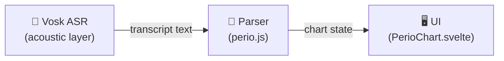

# Perio-Assist — Evaluation Metrics Plan

## Background

The app has three separable subsystems, each needing its own metric layer:



**What already exists:**

| Harness | File | Measures |
|---|---|---|
| Unit tests | [`perio.test.js`](file:///home/abraham/Documents/Projects/carestack/main-code/Perio-Assist/src/perio.test.js) | Parser correctness on hand-written cases |
| Narrative TC suite | [`scripts/cases.js`](file:///home/abraham/Documents/Projects/carestack/main-code/Perio-Assist/scripts/cases.js) | 30 PASS/SKIP/FAIL scenario tests |
| Synthetic eval | [`scripts/eval.js`](file:///home/abraham/Documents/Projects/carestack/main-code/Perio-Assist/scripts/eval.js) | Depth/bleed/rec/status accuracy on random patients |
| Acoustic eval | [`scripts/acoustic-eval/run.py`](file:///home/abraham/Documents/Projects/carestack/main-code/Perio-Assist/scripts/acoustic-eval/run.py) | WER overall + WER on digits, per noise profile |
| Chart-match | [`scripts/acoustic-eval/chartmatch.js`](file:///home/abraham/Documents/Projects/carestack/main-code/Perio-Assist/scripts/acoustic-eval/chartmatch.js) | End-to-end: voice → chart diff vs reference |

**What's missing / not yet wired up:**

- No single command runs everything and prints a summary dashboard
- Acoustic eval has no fixture WAV files yet (`fixtures/` is absent) → `run.py` silently does nothing
- WER is computed but **digit-WER** (the clinically critical sub-metric) is buried in a per-profile loop and not reported as a headline number
- Chart-match only runs on `clean` profile — noisy profiles aren't charted at all
- Parser synthetic eval (`eval.js`) reports suppuration and mobility accuracy, but those fields aren't generated by `gen_clinical.py` → the metrics always report `n/a`
- No latency measurement (parse + render time is tracked in `chart.svelte.js` as `store.latencyMs` but never compared to a budget)
- No confidence-gate metric (Vosk confidence scores are not consumed anywhere)

---

## Relevant Metrics, Ranked by Clinical Importance

### Tier 1 — Direct patient-safety impact

| Metric | Definition | Why it matters |
|---|---|---|
| **Depth accuracy** | `correct_depths / total_depths` | Wrong PD = wrong staging/treatment plan |
| **Bleed accuracy** | `correct_bleed_flags / total_bleed_sites` | False negative BOP hides active disease |
| **Digit-WER** | Edit distance over numeric tokens only | PDs are all digits; digit errors are depth errors |
| **Chart-match (end-to-end)** | Utterances where ASR→parse→chart == reference→parse→chart | The only metric that matters end-to-end |

### Tier 2 — Clinical completeness

| Metric | Definition |
|---|---|
| **Recession accuracy** | `correct_rec / total_rec` |
| **Furcation accuracy** | `grade_match / total_fur` |
| **Mobility accuracy** | `grade_match / total_mob` |
| **Status accuracy** | `correct_absent_flags / total_absent` (MISSING/IMPLANT) |

### Tier 3 — UX / operational

| Metric | Definition | Target |
|---|---|---|
| **Parse latency** | `performance.now()` in `parseInto` | < 5 ms (already tracked) |
| **WER (overall)** | Standard ASR word error rate | Baseline for grammar-constrained Vosk |
| **Noise degradation** | Δ chart-match: clean vs suction vs harsh | Should be < 10 pp drop at suction SNR |

---

## What Needs to Be Built

### Gap 1 — Acoustic eval fixtures (blocker for Tier 1 end-to-end)

`run.py` expects `scripts/acoustic-eval/fixtures/*.wav` — 16 kHz mono WAVs with matching references in `utterances.txt`. Currently that directory has `utterances.txt` and `synth.py` but no WAVs.

**Fix:** `synth.py` exists to generate them. Need to run it (requires `pyttsx3` or `espeak`).

### Gap 2 — Gen_clinical suppuration/mobility (fixes `eval.js` n/a fields)

`gen_clinical.py` never emits suppuration or mobility into the transcript, so `eval.js` always scores those as `n/a`. Either add them to the generator or drop those rows from the eval output.

### Gap 3 — Chart-match on noise profiles

`chartmatch.js` skips non-clean profiles (`if (r.profile !== 'clean') continue`). Need to extend it to score all three profiles to measure noise degradation.

### Gap 4 — Dashboard command

No single `pnpm eval:full` or equivalent runs all harnesses and prints a unified scorecard.

---

## Proposed Changes

### [MODIFY] `scripts/acoustic-eval/synth.py` — generate WAV fixtures
Run it once to populate `fixtures/`. No code change needed; just needs to be executed.

### [MODIFY] `scripts/acoustic-eval/chartmatch.js` — score all profiles

#### [MODIFY] chartmatch.js
```diff
-  if (r.profile !== 'clean') continue; // chart-match on clean only; noise covered by WER
+  // score all profiles separately
```
Group results by profile, print per-profile chart-match %.

### [MODIFY] `scripts/eval.js` — drop suppuration/mobility rows or add to generator

Simplest fix: remove the `recs`/`sup` tracking rows from `eval.js` since `gen_clinical.py` never emits them. Add `# ponytail: sup/mob not generated — add when gen_clinical emits them`.

Or (lazier): add suppuration to `gen_clinical.py` with a low rate (~5%) so the metric becomes meaningful.

### [NEW] `scripts/run_eval.sh` — unified dashboard

```bash
#!/usr/bin/env bash
set -e
echo "=== parser unit tests ==="
node src/perio.test.js
echo ""
echo "=== narrative TC suite ==="
node scripts/cases.js
echo ""
echo "=== synthetic chart eval (seed=1, 10 patients, 16 teeth) ==="
node scripts/eval.js 1 10 16
echo ""
echo "=== acoustic eval (requires fixtures/) ==="
if [ -d scripts/acoustic-eval/fixtures ] && ls scripts/acoustic-eval/fixtures/*.wav 2>/dev/null | head -1; then
  python3 scripts/acoustic-eval/run.py
  node scripts/acoustic-eval/chartmatch.js
else
  echo "  SKIP: no WAV fixtures. Run python3 scripts/acoustic-eval/synth.py first."
fi
```

Add to `package.json`:
```json
"eval:full": "bash scripts/run_eval.sh"
```

### [MODIFY] `scripts/acoustic-eval/synth.py` — check what it does / run it

Read `synth.py` and confirm it produces compliant WAVs (16kHz mono), then run it to populate fixtures.

---

## Verification Plan

### Automated Tests

```bash
# All parser tests pass
pnpm test

# All narrative cases pass (30 pass, 0 fail, N skip)
pnpm cases

# Synthetic eval shows depth ≥ 90%, bleed ≥ 85% on seed=1
pnpm eval

# Full dashboard (after fixtures generated)
pnpm eval:full
```

### Manual Verification

1. Check `eval.js` no longer shows `n/a` for recs/sup/stats fields (or verify the ponytail comment explains the skip)
2. Check `chartmatch.js` now prints per-profile scores (clean / suction / harsh)
3. Confirm `run_eval.sh` exits 0 when all harnesses pass

---

## Open Questions

> [!IMPORTANT]
> **Should suppuration/mobility be added to `gen_clinical.py`?** Right now `eval.js` shows `n/a` for both — the rows exist but the generator never emits them. Options: (a) add them to the generator (small, ~15 lines), or (b) drop those tracking rows from `eval.js` until the generator supports them. Lazier choice: (b).

> [!NOTE]
> **WAV fixture generation:** `synth.py` exists but may need `espeak` or `pyttsx3` installed. We'll check before trying to run it. If TTS isn't available, fixtures can be recorded manually and dropped into `fixtures/`.

> [!NOTE]
> **Confidence-gate metric:** Vosk confidence scores from `m.result.result[].conf` are not consumed anywhere. Measuring confidence vs. accuracy would require instrumenting the recognizer. This is a Tier 3 metric — skip unless you're building the confidence gate feature.
